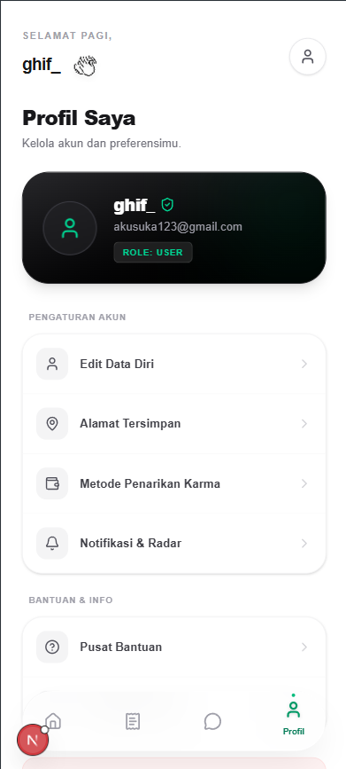
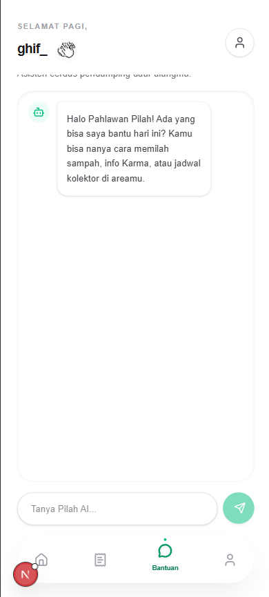
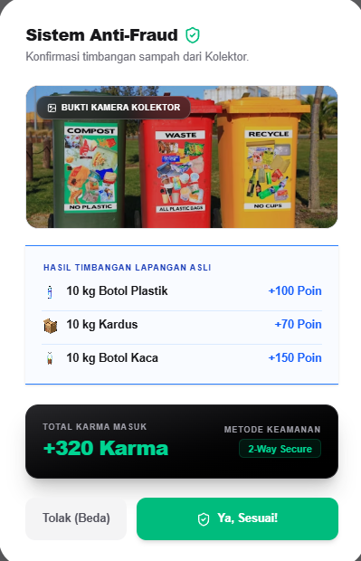
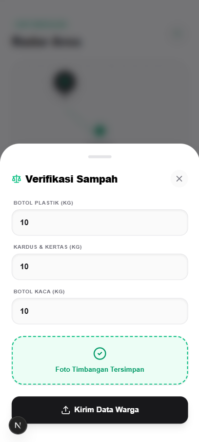
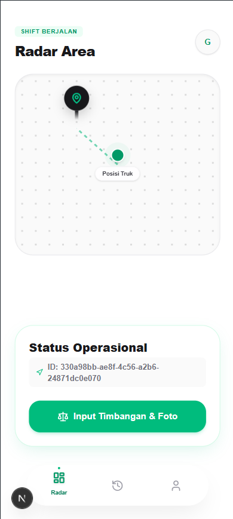
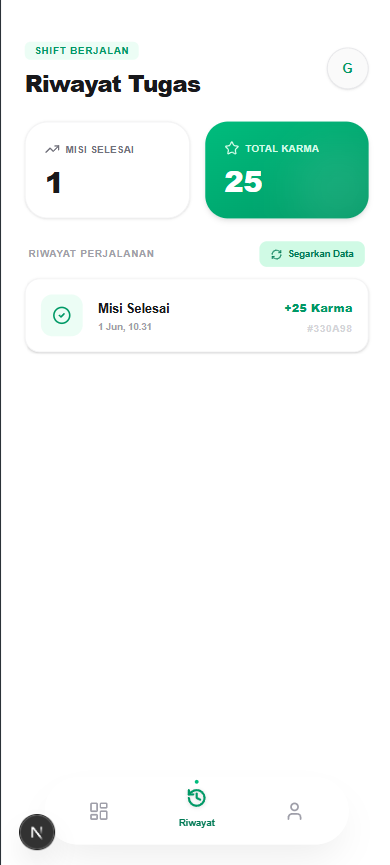
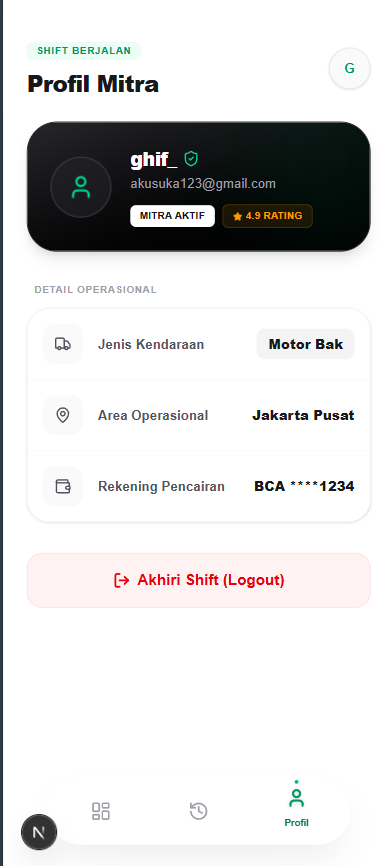

<h1 align="center">🌿 Pilah - Eco-Reward Ecosystem</h1>
<p align="center">
  <i>Bespoke dual-interface platform connecting Pahlawan Pilah (Users) and Mitra (Collectors). Engineered for high performance, zero-bloat UI, and secure Web3-enabled eco-rewards (Karma Points).</i>
</p>

<p align="center">
  
  
  
  
</p>

---

## 🚀 Overview

**Pilah** is a high-efficiency, dual-sided application built for the modern waste management and recycling ecosystem. It features two distinct but deeply integrated client interfaces: the **Warga (User)** portal for scheduling pick-ups and tracking eco-rewards, and the **Mitra (Collector)** portal equipped with live radar tracking and automated task management.

The architecture emphasizes strict security protocols, including a **2-Way Secure Anti-Fraud system** for weight verification, and utilizes a highly optimized, lightweight frontend to ensure fluid performance across low-end mobile devices and premium viewports alike. 

---

## ✨ Key Features

* **Dual-Client Architecture:** Isolated yet perfectly synchronized environments for Users (Warga) and Collectors (Mitra), minimizing unnecessary bundle size and maximizing client-side rendering speed.
* **Web3 Eco-Rewards (Karma Points):** Securely integrated digital wallet system that processes "Karma Points" upon successful waste handshakes. Transactions are transparent, immutable, and optimized for ultra-low latency.
* **2-Way Secure Anti-Fraud System:** Cryptographically verified handshakes between User and Collector. Weight metrics (Plastic, Cardboard, Glass) are cross-validated by camera proof before Karma Points are minted and disbursed.
* **Live Radar & Geolocation Engine:** Hyper-optimized spatial querying to map real-time positions of Mitra trucks. Engineered to drastically reduce redundant API calls and prevent client battery drain.
* **Pilah AI Assistant:** An ultra-lightweight, context-aware chatbot integrated directly into the Warga app to guide users seamlessly on sorting rules and localized pickup schedules.

---

## 📸 Studio Showroom

### 1. Warga (User) Interface
*Empowering users with intuitive dashboards, AI assistance, and transparent reward tracking.*
<p align="center">
  
  
  
</p>
<p align="center"><i>From left to right: Profile Configuration, Context-Aware AI Chat, and Secure Karma Payout Handshake.</i></p>

### 2. Anti-Fraud Verification System
*Ensuring ecosystem integrity with 2-way data matching and visual cryptographic proof.*
<p align="center">
  
  
</p>

### 3. Mitra (Collector) Interface
*High-performance dispatching, real-time area scanning, and task management.*
<p align="center">
  
  
  
</p>
<p align="center"><i>From left to right: Active Truck Radar & Scale Input, Task History Metrics, and Mitra Operational Profile.</i></p>

---

## 🛠 Tech Stack & Architecture

* **Frontend Engine:** Next.js 14 (App Router) - Utilizing strict server components for optimal Core Web Vitals and SEO.
* **State & Memory Management:** Zustand - Ensuring isolated component re-renders, preventing memory leaks, and managing global UI states (like the Radar map) flawlessly.
* **Backend Architecture:** Native Golang - Engineered for absolute minimum computational overhead, utilizing robust concurrency models for API delivery and rapid handshake validations.
* **Styling:** Tailwind CSS - Utility-first styling for a completely bespoke, responsive design with zero runtime overhead.
* **Security & Database:** Parameterized ORM queries coupled with strict connection pooling to prevent SQL injection and throttle database server costs. 
* **Web3 Integration:** Custom smart contracts integration for Karma Point tokenomics.

---

## 💻 Local Development Setup

Follow these protocols to clone and initialize the secure development environment locally:

```bash
1. Environment Setup & Dependency Installation
git clone [https://github.com/med4ka/pilah-app.git](https://github.com/med4ka/pilah-app.git)
cd pilah-app

2. Initialize Frontend & Backend Workspaces
Install dependencies using strict package resolution.

# Frontend setup
cd frontend
pnpm install

# Backend setup (Open a new terminal)
cd ../backend
go mod tidy

3. Security & Environment Variables
Initialize your secure local environment parameters.

# In frontend directory
cp .env.example .env.local

# In backend directory
cp .env.example .env

4. Execute Production-Optimized Dev Servers
# In frontend directory
pnpm run dev

# In backend directory
go run main.go
